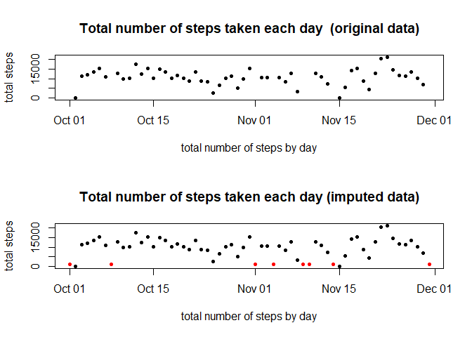

## Loading and preprocessing the data

1. Load the data (i.e. read.csv())


```r
setwd("C:/Users/lezam/Documents/GitHub/RepData_PeerAssessment1")
pathFiles <- unzip("./activity.zip",list=TRUE)[,1]
file_store <- unz("./activity.zip", pathFiles)
data <- read.csv(file_store, head = TRUE)
str(data)
```

```
## 'data.frame':	17568 obs. of  3 variables:
##  $ steps   : int  NA NA NA NA NA NA NA NA NA NA ...
##  $ date    : Factor w/ 61 levels "2012-10-01","2012-10-02",..: 1 1 1 1 1 1 1 1 1 1 ...
##  $ interval: int  0 5 10 15 20 25 30 35 40 45 ...
```

2. Process/transform the data (if necessary) into a format suitable for your analysis

The format of the *date variable* is factor, I transform it to *date format*. 


```r
data$date <- as.Date(data$date, "%Y-%m-%d")
```

## What is mean total number of steps taken per day?

For this part of the assignment, you can ignore the missing values in the dataset.

1. Calculate the total number of steps taken per day


```r
library(dplyr, quietly = TRUE)
data <- tbl_df(data)
total_by_date <- data %>% 
        group_by(date) %>% 
        summarise(stepsByDay = sum(steps))
total_by_date
```

```
## # A tibble: 61 x 2
##    date       stepsByDay
##    <date>          <int>
##  1 2012-10-01         NA
##  2 2012-10-02        126
##  3 2012-10-03      11352
##  4 2012-10-04      12116
##  5 2012-10-05      13294
##  6 2012-10-06      15420
##  7 2012-10-07      11015
##  8 2012-10-08         NA
##  9 2012-10-09      12811
## 10 2012-10-10       9900
## # ... with 51 more rows
```
2. If you do not understand the difference between a histogram and a barplot, research the difference between them. Make a histogram of the total number of steps taken each day


```r
hist(total_by_date$stepsByDay, 
     xlab = "total number of steps by day",
     main = "Total number of steps taken each day")
```

<!-- -->

```r
png(filename="./instructions_fig/plot1.png")
hist(total_by_date$stepsByDay, 
     xlab = "total number of steps by day",
     main = "Total number of steps taken each day")
dev.off()
```

```
## png 
##   2
```

3. Calculate and report the mean and median of the total number of steps taken per day


```r
mean_steps <- mean(total_by_date$stepsByDay, na.rm = TRUE)
median_steps <- median(total_by_date$stepsByDay, na.rm = TRUE)
mean_steps
```

```
## [1] 10766.19
```

```r
median_steps
```

```
## [1] 10765
```
The mean and median of the total number of steps taken per day are 10766.19 and 10765, respectively.

## What is the average daily activity pattern?
1. Make a time series plot (i.e. type = "l") of the 5-minute interval (x-axis) and the average number of steps taken, averaged across all days (y-axis)


```r
mean_by_interval <- data %>% 
        group_by(interval) %>% 
        summarise(mean_steps = mean(steps, na.rm = TRUE))
with(mean_by_interval, plot(interval, 
                            mean_steps, type = "l", 
                            ylab = "average number of steps taken",
                            main = "Average number steps by interval"))
```

<!-- -->

```r
png(filename="./instructions_fig/plot2.png")
with(mean_by_interval, plot(interval, 
                            mean_steps, type = "l", 
                            ylab = "average number of steps taken",
                            main = "Average number steps by interval"))

dev.off()
```

```
## png 
##   2
```

2. Which 5-minute interval, on average across all the days in the dataset, contains the maximum number of steps?


```r
max <- mean_by_interval[which(mean_by_interval$mean_steps == max(mean_by_interval$mean_steps)),]
max
```

```
## # A tibble: 1 x 2
##   interval mean_steps
##      <int>      <dbl>
## 1      835       206.
```

The 835 5-minute interval contains the maximum number of steps: 206.17.

## Imputing missing values
1. Calculate and report the total number of missing values in the dataset (i.e. the total number of rows with NAs)


```r
total_missing <- sum(!complete.cases(data$steps))
total_missing
```

```
## [1] 2304
```
The total number of missing values in the dataset is 2304.

2. Devise a strategy for filling in all of the missing values in the dataset. The strategy does not need to be sophisticated. For example, you could use the mean/median for that day, or the mean for that 5-minute interval, etc.

**My strategy is to impute the missing values with the median for the 5-minute interval.**

3. Create a new dataset that is equal to the original dataset but with the missing data filled in.

With my strategy I created  a new data set called *data_complete*.

```r
missing <- data %>% 
        filter(!complete.cases(steps))
imput <- data %>% 
        filter(complete.cases(steps)) %>% 
        group_by(interval) %>% 
        summarise(median_steps = median(steps))
   
imputed_data <- merge(missing, imput, by = "interval")
data_complete <- left_join(data, 
                           imputed_data, 
                           by = c("date", "interval"))
names(data_complete)[1] <- "steps"
data_complete$steps[is.na(data_complete$steps)] <- data_complete$median_steps[is.na(data_complete$steps)] 
data_complete <- data_complete[,c(1,2,3)]
summary(data_complete$steps)
```

```
##    Min. 1st Qu.  Median    Mean 3rd Qu.    Max. 
##       0       0       0      33       8     806
```
In *data_complete* there are not missing values.

4. Make a histogram of the total number of steps taken each day and Calculate and report the mean and median total number of steps taken per day. Do these values differ from the estimates from the first part of the assignment? What is the impact of imputing missing data on the estimates of the total daily number of steps?


```r
total_by_date_complete <- data_complete %>% 
        group_by(date) %>% 
        summarise(stepsByDay = sum(steps))
hist(data_complete$steps)
```

<!-- -->

```r
png(filename="./instructions_fig/plot3.png")
hist(data_complete$steps)
dev.off()
```

```
## png 
##   2
```


```r
mean_steps_complete <- mean(total_by_date_complete$stepsByDay)
median_steps_complete <- median(total_by_date_complete$stepsByDay)
ratio_means <- mean_steps_complete / mean_steps
ratio_medians <- median_steps_complete / median_steps
```
There is a difference: both measures decrease when using the imputed data.

- The mean total number of steps taken per day is 9503.87 (with the initial data we obtained 10766.19).   


- The median total number of steps taken per day is10395 (with the initial data we obtained 10765).   

To measure the impact of imputing missing data on the estimates of the total daily number of steps, I make two graphs and calculate the ratio between both measurements.


```r
diff <- merge(total_by_date, total_by_date_complete, by = "date")
diff$imputed <- as.factor(ifelse(is.na(diff$stepsByDay.x),"1","0"))
par(mfrow = c(2,1))
plot(diff$date, diff$stepsByDay.x, 
     xlab = "total number of steps by day",
     ylab = "total steps",
     main = "Total number of steps taken each day  (original data)",
     pch = 20)
plot(diff$date, diff$stepsByDay.y, 
     col = diff$imputed,
     xlab = "total number of steps by day",
     ylab = "total steps",
     main = "Total number of steps taken each day (imputed data)",
     pch = 20)
```

<!-- -->

```r
png(filename="./instructions_fig/plot4.png")
plot(diff$date, diff$stepsByDay.y, 
     col = diff$imputed,
     xlab = "total number of steps by day",
     ylab = "total steps",
     main = "Total number of steps taken each day (imputed data)",
     pch = 20)
dev.off()
```

```
## png 
##   2
```

```r
t_original <- sum(diff$stepsByDay.x, na.rm = TRUE)
t_imputed <- sum(diff$stepsByDay.y)
ratio = t_imputed / t_original 
```
In the previous graph we can see the added red points as a result of the imputation.

The impact of estimates of the total daily number of steps when using imputed data is $\Big(\frac{\text{total daily number of steps with imputed data }}{\text{total daily number of steps with original data}}-1\Big)\%=$ 1.60%.

## Are there differences in activity patterns between weekdays and weekends?

For this part the weekdays() function may be of some help here. Use the dataset with the filled-in missing values for this part.

1. Create a new factor variable in the dataset with two levels – “weekday” and “weekend” indicating whether a given date is a weekday or weekend day.

```r
data_complete$week <- factor(ifelse(weekdays(data_complete$date) %in% c("Saturday","Sunday"), "weekend", "weekday"))
```

2. Make a panel plot containing a time series plot (i.e. type = "l") of the 5-minute interval (x-axis) and the average number of steps taken, averaged across all weekday days or weekend days (y-axis). 


```r
library(lattice)
dc_by_day <- data_complete %>% 
        group_by(interval, week) %>% 
        summarise(mean_step_day = mean(steps))
xyplot(mean_step_day ~ interval | week, data = dc_by_day, layout = c(1,2), type ="l")
```

<!-- -->

```r
png(filename="./instructions_fig/plot5.png")
xyplot(mean_step_day ~ interval | week, data = dc_by_day, layout = c(1,2), type ="l")
dev.off()
```

```
## png 
##   2
```

